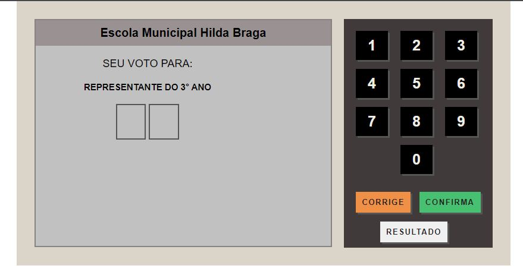

# Urna Eletrônica

Urna eletrônica é um projeto voluntário feito para alunos da Escola Municipal Hilda Braga, onde através da eleição para representante de turma, eles conheceram na prática como funciona o sistema de votação brasileiro. A pedido do professor responsável, realizei algumas alterações para facilitar a usabilidade dos alunos e proporcionar mais realismo, entre eles o responsivo do projeto e inclusão do som de confirmação de voto.

 

Neste sistema é possível corrigir números, confirmar e armazenar votos através do localStorage, caso precise apagar os votos computados, limpe os cookies do seu navegador.

 

## Tecnologias utilizadas.

 

## Links importantes.
Projeto: 
 
Linkedin: https://www.linkedin.com/in/tiagoribeirotech/